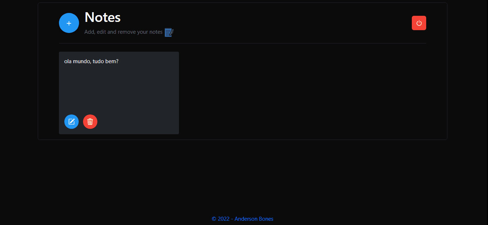

# notes-app

Notes funciona como um bloco de notas, onde voce armazena suas anotações 
e tudo aquilo que voce não pode esquecer :)

### Requisitos Globais
`npm install -g ts-node typescript nodemon`

### Instação 
`npm install`

### Para rodar o projeto
`npm run start-dev`

### Screenshots

### Live Demo
<a href="https://notes-app-f54y.onrender.com/">Live Demo</a>

o código do projeto principal está na branch v2
